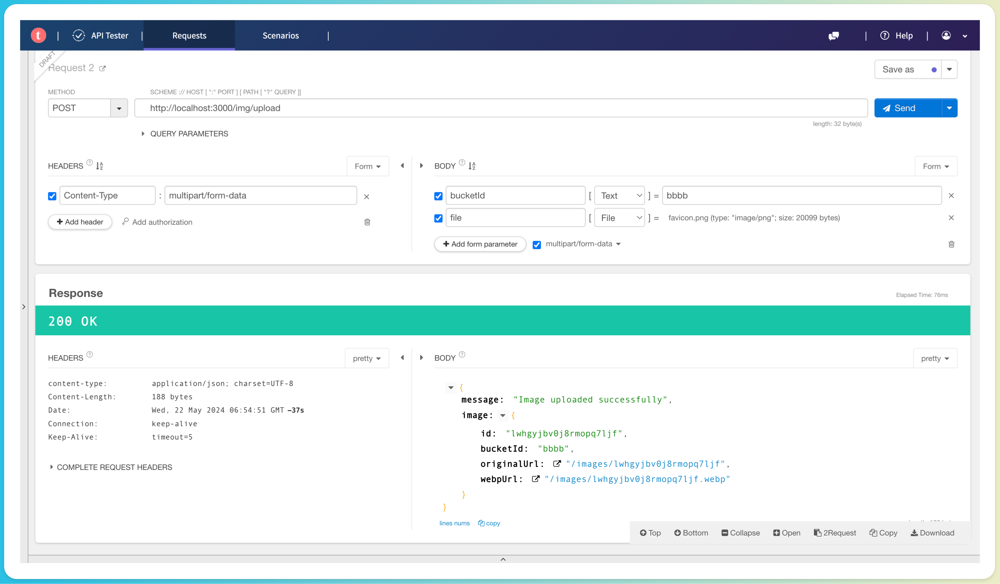

图片文件流读取和处理那一块内容可能是因为hono是个比较新的框架，网上的代码比较少导致它使用了很多不合适的代码。
反复问意义不大，解决问题不如自己翻文档或者翻issues来的要快。我为了加快节奏自己看文档和issues对那块代码进行了人工校正。

具体参考的文档链接为 [hono file upload](https://hono.dev/snippets/file-upload) | [Feature request: support for file upload](https://github.com/honojs/hono/issues/664)

到目前止业务基础代码已经有了，我们来run一下测试一波。

在index.ts中导入controller和serve-static中间件，并手动创建一下上传文件目录。
加入代码为 

```
import imageController from './controllers/imageController'

//这个是静态文件处理的路由 见 https://hono.dev/getting-started/nodejs#serve-static-files
import { serveStatic } from '@hono/node-server/serve-static' 

app.use('/static/*', serveStatic({ root: './' }))

```

然后就 *npm run dev*

我用浏览器插件 **Talend API Tester** 进行了一波测试 发现报错如下

```
ZodError: [
  {
    "validation": "uuid",
    "code": "invalid_string",
    "message": "Invalid uuid",
    "path": [
      "id"
    ]
  },
  {
    "validation": "uuid",
    "code": "invalid_string",
    "message": "Invalid uuid",
    "path": [
      "bucketId"
    ]
  },
  {
    "validation": "url",
    "code": "invalid_string",
    "message": "Invalid url",
    "path": [
      "originalUrl"
    ]
  },
  {
    "validation": "url",
    "code": "invalid_string",
    "message": "Invalid url",
    "path": [
      "webpUrl"
    ]
  }
]
    at get error [as error] (/Users/ryan/data/hono-webs/tuchuang/node_modules/zod/lib/types.js:55:31)
    at ZodObject.parse (/Users/ryan/data/hono-webs/tuchuang/node_modules/zod/lib/types.js:160:22)
    at Array.<anonymous> (/Users/ryan/data/hono-webs/tuchuang/src/controllers/imageController.ts:38:32)
    at async responseViaResponseObject (/Users/ryan/data/hono-webs/tuchuang/node_modules/@hono/node-server/dist/index.js:368:13) {
  issues: [
    {
      validation: 'uuid',
      code: 'invalid_string',
      message: 'Invalid uuid',
      path: [Array]
    },
    {
      validation: 'uuid',
      code: 'invalid_string',
      message: 'Invalid uuid',
      path: [Array]
    },
    {
      validation: 'url',
      code: 'invalid_string',
      message: 'Invalid url',
      path: [Array]
    },
    {
      validation: 'url',
      code: 'invalid_string',
      message: 'Invalid url',
      path: [Array]
    }
  ],
  addIssue: [Function (anonymous)],
  addIssues: [Function (anonymous)],
  errors: [
    {
      validation: 'uuid',
      code: 'invalid_string',
      message: 'Invalid uuid',
      path: [Array]
    },
    {
      validation: 'uuid',
      code: 'invalid_string',
      message: 'Invalid uuid',
      path: [Array]
    },
    {
      validation: 'url',
      code: 'invalid_string',
      message: 'Invalid url',
      path: [Array]
    },
    {
      validation: 'url',
      code: 'invalid_string',
      message: 'Invalid url',
      path: [Array]
    }
  ]
}

```

从日志输出上可以看出是 controllers/imageController.ts:38:32这行 `const newImage = ImageSchema.parse({ id, bucketId, originalUrl, webpUrl });` 报错的。那我来问一下AI

Me:
----------

还记得我们之前在做的图床项目，你给了我代码在文件 ‘controllers/imageController.ts’中 const newImage = ImageSchema.parse({ id, bucketId, originalUrl, webpUrl }); 这段代码抛出了异常，请问是什么原因？

AI:
-----------

在你提供的代码片段中，`ImageSchema.parse` 方法用于验证和解析一个对象，以确保它符合 `ImageSchema` 的结构和类型。如果传入的对象不符合 `ImageSchema` 的定义，那么 `parse` 方法将会抛出一个异常。

异常的具体原因取决于 `ImageSchema` 的定义和传入对象 `{ id, bucketId, originalUrl, webpUrl }` 的实际值。以下是一些可能的原因：

1. **缺少必需的属性**：如果 `ImageSchema` 定义了一些必需的属性，但是传入的对象没有包含这些属性，那么 `parse` 方法将会抛出异常。

2. **属性类型不匹配**：如果 `ImageSchema` 定义了某个属性的类型，但是传入的对象中的属性值的类型与之不匹配，那么 `parse` 方法将会抛出异常。

3. **属性值不符合验证规则**：如果 `ImageSchema` 定义了一些属性的验证规则，但是传入的对象中的属性值不符合这些规则，那么 `parse` 方法将会抛出异常。

为了解决这个问题，你需要检查 `ImageSchema` 的定义，确保它与你的数据模型相匹配。你也需要检查传入对象 `{ id, bucketId, originalUrl, webpUrl }` 的实际值，确保它们符合 `ImageSchema` 的要求。

如果问题仍然存在，你可能需要提供更多的代码上下文，以便我能够更准确地诊断问题。


----------------------------


哦，明白了，这是zod严重的错误，我们先不要对字段进行验证，去掉字段格式验证全部调整为字符串。

models/image.ts 之前的代码

```
import { z } from 'zod';

export const ImageSchema = z.object({
  id: z.string().uuid(),
  bucketId: z.string().uuid(), // 关联的存储桶 ID
  originalUrl: z.string().url(), // 原始图片 URL
  webpUrl: z.string().url(), // 转换为 webp 格式的图片 URL
  // 其他字段...
});

export type Image = z.infer<typeof ImageSchema>;
```

手动调整后 models/image.ts 的代码

```
import { z } from 'zod';

export const ImageSchema = z.object({
  id: z.string(),
  bucketId: z.string(), // 关联的存储桶 ID
  originalUrl: z.string(), // 原始图片 URL
  webpUrl: z.string(), // 转换为 webp 格式的图片 URL
  // 其他字段...
});

export type Image = z.infer<typeof ImageSchema>;

```

调整后运行正常返回了正确的结果。




原图650多kb的图片压缩处理后的webp图片只有99kb，很棒可以看doc下的TinySnap-2024-05-22-15.12.51.png原图和 static/uploads/images/lwhhwu0rxkko3dzjcyq.webp 

